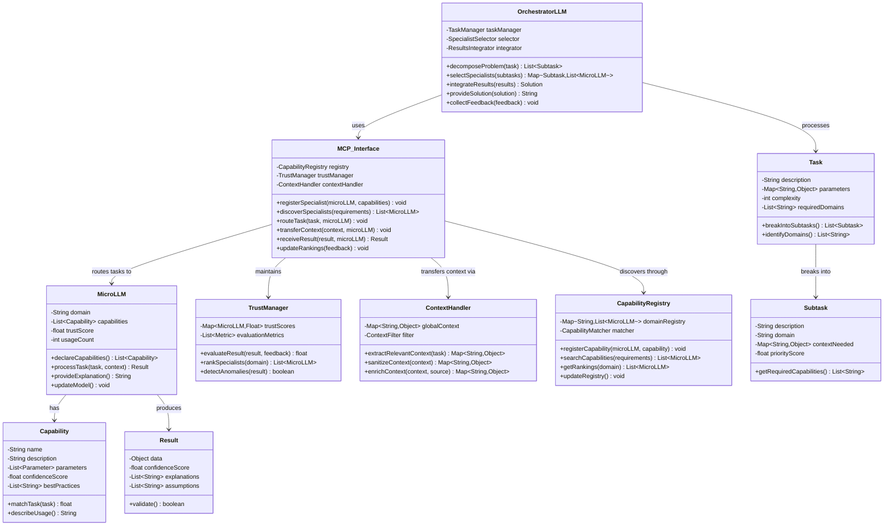

```mermaid
classDiagram
    class OrchestratorLLM {
        -TaskManager taskManager
        -SpecialistSelector selector
        -ResultsIntegrator integrator
        +decomposeProblem(task) List~Subtask~
        +selectSpecialists(subtasks) Map~Subtask,List~MicroLLM~~
        +integrateResults(results) Solution
        +provideSolution(solution) String
        +collectFeedback(feedback) void
    }
    
    class MCP_Interface {
        -CapabilityRegistry registry
        -TrustManager trustManager
        -ContextHandler contextHandler
        +registerSpecialist(microLLM, capabilities) void
        +discoverSpecialists(requirements) List~MicroLLM~
        +routeTask(task, microLLM) void
        +transferContext(context, microLLM) void
        +receiveResult(result, microLLM) Result
        +updateRankings(feedback) void
    }
    
    class MicroLLM {
        -String domain
        -List~Capability~ capabilities
        -float trustScore
        -int usageCount
        +declareCapabilities() List~Capability~
        +processTask(task, context) Result
        +provideExplanation() String
        +updateModel() void
    }
    
    class Capability {
        -String name
        -String description
        -List~Parameter~ parameters
        -float confidenceScore
        -List~String~ bestPractices
        +matchTask(task) float
        +describeUsage() String
    }
    
    class Task {
        -String description
        -Map~String,Object~ parameters
        -int complexity
        -List~String~ requiredDomains
        +breakIntoSubtasks() List~Subtask~
        +identifyDomains() List~String~
    }
    
    class Subtask {
        -String description
        -String domain
        -Map~String,Object~ contextNeeded
        -float priorityScore
        +getRequiredCapabilities() List~String~
    }
    
    class Result {
        -Object data
        -float confidenceScore
        -List~String~ explanations
        -List~String~ assumptions
        +validate() boolean
    }
    
    class TrustManager {
        -Map~MicroLLM,Float~ trustScores
        -List~Metric~ evaluationMetrics
        +evaluateResult(result, feedback) float
        +rankSpecialists(domain) List~MicroLLM~
        +detectAnomalies(result) boolean
    }
    
    class ContextHandler {
        -Map~String,Object~ globalContext
        -ContextFilter filter
        +extractRelevantContext(task) Map~String,Object~
        +sanitizeContext(context) Map~String,Object~
        +enrichContext(context, source) Map~String,Object~
    }
    
    class CapabilityRegistry {
        -Map~String,List~MicroLLM~~ domainRegistry
        -CapabilityMatcher matcher
        +registerCapability(microLLM, capability) void
        +searchCapabilities(requirements) List~MicroLLM~
        +getRankings(domain) List~MicroLLM~
        +updateRegistry() void
    }
    
    OrchestratorLLM --> MCP_Interface : uses
    MCP_Interface --> MicroLLM : routes tasks to
    MicroLLM --> Capability : has
    OrchestratorLLM --> Task : processes
    Task --> Subtask : breaks into
    MicroLLM --> Result : produces
    MCP_Interface --> TrustManager : maintains
    MCP_Interface --> ContextHandler : transfers context via
    MCP_Interface --> CapabilityRegistry : discovers through
```
