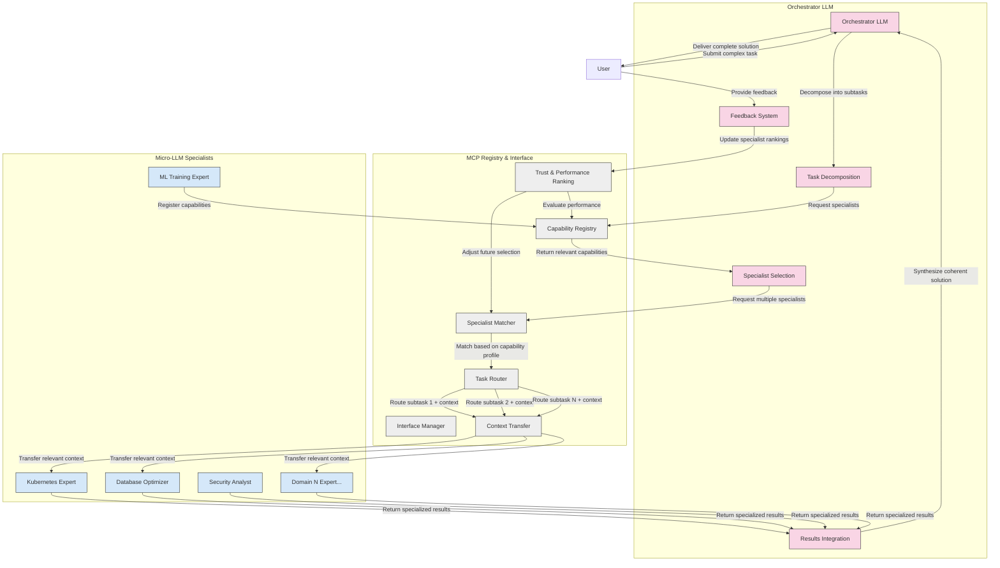

```mermaid
flowchart TD
    subgraph "Orchestrator LLM"
        OL[Orchestrator LLM]
        TaskDecomp[Task Decomposition]
        SpecSelection[Specialist Selection]
        ResultsIntegration[Results Integration]
        FeedbackSystem[Feedback System]
    end

    subgraph "MCP Registry & Interface"
        Registry[Capability Registry]
        Interface[Interface Manager]
        TaskRouter[Task Router]
        ContextTransfer[Context Transfer]
        SpecMatcher[Specialist Matcher]
        TrustRanking[Trust & Performance Ranking]
    end

    subgraph "Micro-LLM Specialists"
        Spec1[Kubernetes Expert]
        Spec2[Database Optimizer]
        Spec3[Security Analyst]
        Spec4[ML Training Expert]
        SpecN[Domain N Expert...]
    end

    %% Primary Flow
    User -->|"Submit complex task"| OL
    OL -->|"Decompose into subtasks"| TaskDecomp
    TaskDecomp -->|"Request specialists"| Registry
    Registry -->|"Return relevant capabilities"| SpecSelection
    SpecSelection -->|"Request multiple specialists"| SpecMatcher
    SpecMatcher -->|"Match based on capability profile"| TaskRouter
    
    %% Context Flow
    TaskRouter -->|"Route subtask 1 + context"| ContextTransfer
    ContextTransfer -->|"Transfer relevant context"| Spec1
    TaskRouter -->|"Route subtask 2 + context"| ContextTransfer
    ContextTransfer -->|"Transfer relevant context"| Spec2
    TaskRouter -->|"Route subtask N + context"| ContextTransfer
    ContextTransfer -->|"Transfer relevant context"| SpecN
    
    %% Result Flow
    Spec1 -->|"Return specialized results"| ResultsIntegration
    Spec2 -->|"Return specialized results"| ResultsIntegration
    Spec3 -->|"Return specialized results"| ResultsIntegration
    SpecN -->|"Return specialized results"| ResultsIntegration
    
    ResultsIntegration -->|"Synthesize coherent solution"| OL
    OL -->|"Deliver complete solution"| User
    
    %% Feedback Loop
    User -->|"Provide feedback"| FeedbackSystem
    FeedbackSystem -->|"Update specialist rankings"| TrustRanking
    TrustRanking -->|"Adjust future selection"| SpecMatcher
    
    %% Dynamic Capability Discovery
    Spec4 -->|"Register capabilities"| Registry
    
    %% Trust System
    TrustRanking -->|"Evaluate performance"| Registry

    class OL,TaskDecomp,SpecSelection,ResultsIntegration,FeedbackSystem orchestrator;
    class Registry,Interface,TaskRouter,ContextTransfer,SpecMatcher,TrustRanking mcp;
    class Spec1,Spec2,Spec3,Spec4,SpecN specialists;
    
    classDef orchestrator fill:#f9d5e5,stroke:#333,stroke-width:1px;
    classDef mcp fill:#eeeeee,stroke:#333,stroke-width:1px;
    classDef specialists fill:#d5e8f9,stroke:#333,stroke-width:1px;
```
